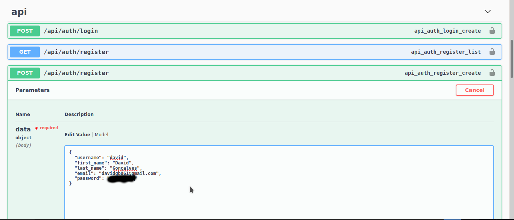
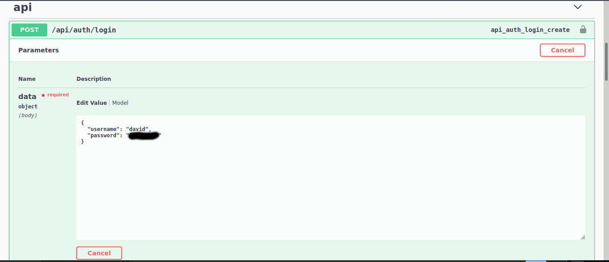
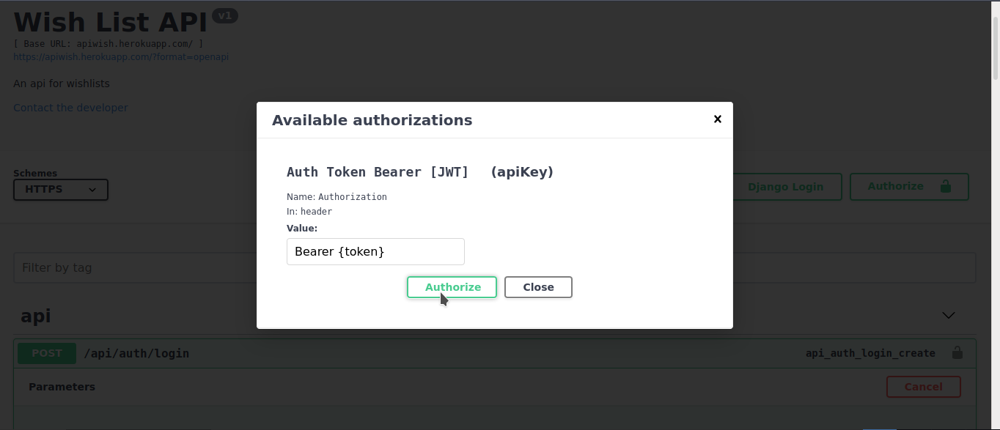
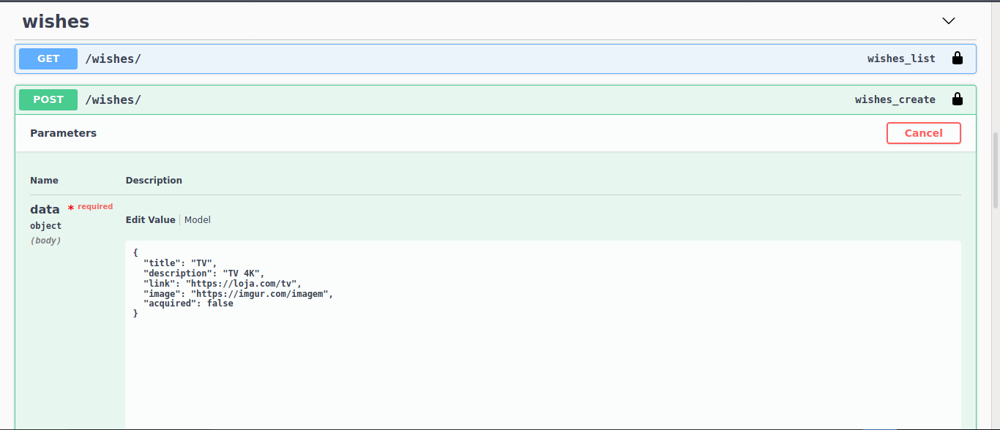
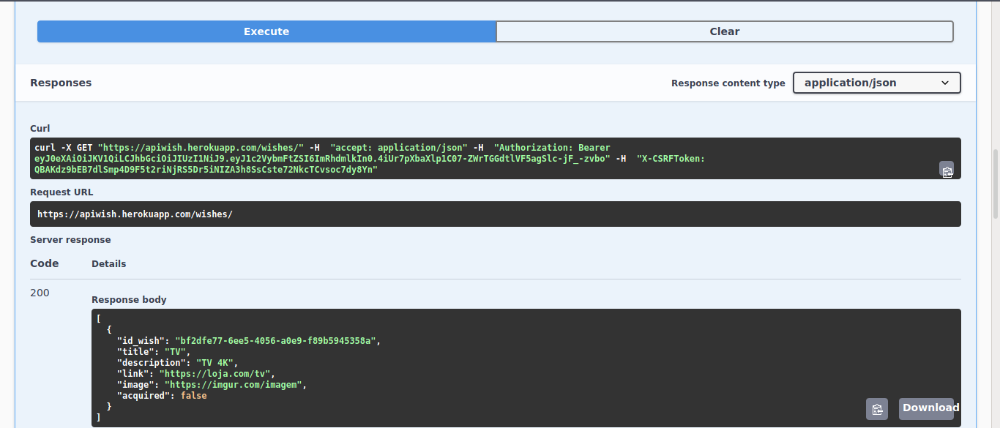
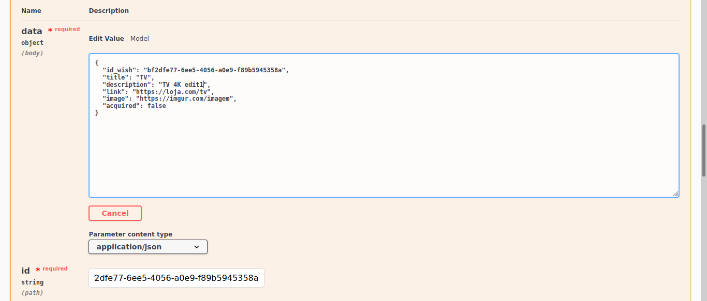

<h1 align="center">
  <a href="https://apiwish.herokuapp.com/">Api Wish

</h1>

Uma API para gerir uma wishlist desenvolvida usando Python

### Features

- [x] Cadastro e autenticação de usuário
- [x] Cadastrar, alterar, e deletar itens da wishlist
- [x] Visualizar a lista dos itens cadastrados de forma completa ou randomicamente um item

<h1 align="center">Utilização</h1>

Antes de cadastrar um item na wishlist, é necessário criar um usuário e fazer o login

Para registrar um usuário basta clicar em "try it out" no método POST de api/auth/register, modificar os campos e executar

<h1 align="center">
  
</h1>

Para fazer o login, é necessário usar o método POST de api/auth/login e colocar o username e senha cadastrados

<h1 align="center">
  
</h1>

Após isso, será mostrado um token no resultado do login, para autenticar é necessário copiar o token, e colocá-lo em "Authorize" da mesma forma que está descrito na imagem
 

<h1 align="center">
  
</h1>

Depois de autenticar, é possivel adicionar um item na wishlist, para isso basta usar o método POST de /wishes/ e modificar os campos de acordo com o desejado
 

<h1 align="center">
  
</h1>

Para visualizar os itens cadastrados, é usado o método GET de /wishes/
 

<h1 align="center">
  
</h1>

E para modificar os dados de um item cadastrado é usado o método PUT de /wishes/, mudar os campos desejados e passar o id do item que será modificado
 

<h1 align="center">
  
</h1>

O endpoint /random/ retorna aleatóriamente um item da lista

E para deletar um item basta usar o método DELETE de /wishes/ e passar o id do item a ser deletado

